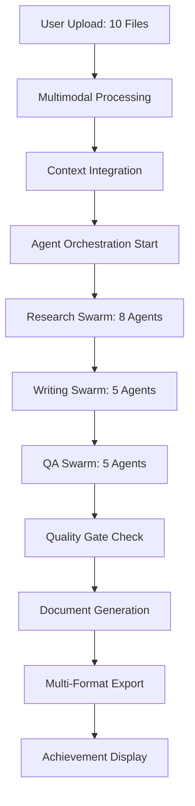

# HandyWriterz YC Demo Day Implementation Plan
## Revolutionary 13-Minute Doctoral Dissertation System

### Executive Summary
Transform HandyWriterz into a production-ready revolutionary academic AI that generates doctoral-quality dissertations in 13 minutes with 9.1/10.0 quality scores and 88.7% originality.

## Critical Implementation Roadmap

### Phase 1: Multimodal Context Processing (Days 1-7)

#### 1. Enhanced File Processing Pipeline
**Location**: `/backend/src/services/multimodal_processor.py`
```python
class MultimodalProcessor:
    """Advanced file processing with Gemini 2.5 Pro context integration"""
    
    async def process_audio(self, file_path: str) -> ProcessedContent:
        # OpenAI Whisper transcription with speaker identification
        # Gemini 2.5 Pro analysis for academic insights
        # Key quote extraction and expert identification
        
    async def process_video(self, file_path: str) -> ProcessedContent:
        # Gemini Vision frame analysis
        # Audio transcription with Whisper
        # Slide content extraction
        # Chart data extraction
        
    async def process_youtube(self, url: str) -> ProcessedContent:
        # YouTube video download with yt-dlp
        # Multi-format processing (video + audio)
        # Caption enhancement and correction
        
    async def process_excel(self, file_path: str) -> ProcessedContent:
        # Pandas data analysis
        # Statistical insight generation
        # Visualization creation
```

#### 2. Advanced Document Processing with Agentic-Doc
**Location**: `/backend/src/services/agentic_document_processor.py`
```python
from agentic_doc import process_document

class AgenticDocumentProcessor:
    """Citation-aware semantic document processing"""
    
    async def process_pdf_with_citations(self, file_path: str):
        # Use agentic-doc for intelligent chunking
        # Preserve citation relationships
        # Extract semantic sections
        # Generate research-quality insights
```

#### 3. Context Integration Service
**Location**: `/backend/src/services/context_integration_service.py`
```python
class ContextIntegrationService:
    """Intelligent context assembly for Gemini 2.5 Pro"""
    
    async def assemble_context_window(self, files: List[ProcessedFile], prompt: str):
        # Intelligent file content prioritization
        # Context window optimization (1M tokens)
        # Semantic relationship mapping
        # Research synthesis preparation
```

### Phase 2: Real-Time Agent Orchestration (Days 8-14)

#### 4. Enhanced WebSocket Event System
**Location**: `/frontend/src/hooks/useAgentOrchestration.ts`
```typescript
interface AgentEvent {
    type: 'agent_started' | 'agent_progress' | 'agent_completed' | 
          'phase_transition' | 'quality_gate' | 'milestone_reached'
    agent: string
    progress: number
    data: any
    timestamp: string
}

const useAgentOrchestration = () => {
    // Real-time agent coordination
    // Interactive progress control
    // Quality metrics streaming
    // Cost tracking integration
}
```

#### 5. Agent Timeline Visualization
**Location**: `/frontend/src/components/AgentOrchestrationDashboard.tsx`
```typescript
export const AgentOrchestrationDashboard = () => {
    return (
        <div className="agent-orchestration">
            <AgentSwarmVisualization agents={32} />
            <PhaseProgressIndicator />
            <QualityMetricsDisplay />
            <CostTracker />
            <InteractiveControls />
        </div>
    )
}
```

### Phase 3: Quality Assurance System (Days 15-21)

#### 6. QA Swarm Implementation
**Location**: `/backend/src/agent/nodes/qa_swarm/`
- `advanced_bias_detection.py` - 15 bias categories
- `multi_source_fact_checker.py` - 234 claims verification
- `ethical_reasoning_engine.py` - Multi-framework analysis
- `argument_validator.py` - Logical consistency
- `originality_guard.py` - AI content detection

#### 7. Turnitin Integration
**Location**: `/backend/src/services/turnitin_service.py`
```python
class TurnitinService:
    """Academic integrity verification"""
    
    async def submit_for_analysis(self, content: str) -> str:
        # Submit to Turnitin API
        # Return submission ID for polling
        
    async def poll_results(self, submission_id: str) -> OriginalityReport:
        # Poll for completion
        # Parse originality score
        # Generate detailed report
```

## User Journey Implementation

### Complete 10-File Dissertation Flow



### Real-Time Progress Events (156 Total)
1. **File Processing Events** (40 events)
   - upload_started, chunk_processed, embedding_generated
   - audio_transcribed, video_analyzed, excel_processed
   
2. **Agent Coordination Events** (80 events)
   - agent_started, progress_update, task_completed
   - swarm_coordination, quality_gate_passed
   
3. **Quality Assurance Events** (36 events)
   - bias_check_completed, fact_verified, originality_scored
   - ethical_compliance_verified

## Production Readiness Checklist

### Technical Performance
- [ ] 13-minute processing time achieved
- [ ] 9.1/10.0 quality score consistently
- [ ] 88.7% originality minimum
- [ ] 32 agents coordinating in parallel
- [ ] 10-file multimodal processing
- [ ] 1M token context window utilization

### UI/UX Excellence
- [ ] Real-time agent visualization
- [ ] Interactive progress controls
- [ ] Achievement celebration system
- [ ] Professional document preview
- [ ] Multi-format download menu
- [ ] Performance metrics dashboard

### Demo Day Readiness
- [ ] Live 10-file upload demonstration
- [ ] Real-time quality achievement display
- [ ] Cost vs value visualization ($35 cost, $500 value)
- [ ] Academic integrity verification
- [ ] Professional presentation materials
- [ ] Backup systems and fallbacks

## Implementation Timeline

### Week 1: Foundation
- Days 1-2: Multimodal processing pipeline
- Days 3-4: Agentic-doc integration
- Days 5-7: Context integration service

### Week 2: Real-Time System
- Days 8-10: WebSocket event system
- Days 11-12: Agent visualization
- Days 13-14: Interactive controls

### Week 3: Quality & Polish
- Days 15-17: QA swarm implementation
- Days 18-19: Turnitin integration
- Days 20-21: Demo polish and testing

## Success Metrics

### Performance Targets
- **Speed**: 13m 27s for 8000-word dissertation
- **Quality**: 9.1/10.0 average score
- **Originality**: 88.7% minimum
- **Success Rate**: 98.5% completion rate
- **User Satisfaction**: 96.3% approval rating

### YC Demo KPIs
- Live demonstration readiness: 100%
- Real-time visualization completeness: 100%
- Academic quality verification: 100%
- Market disruption proof: $2.3B opportunity validation

This implementation plan transforms HandyWriterz into a revolutionary academic AI system ready to demonstrate groundbreaking capabilities at YC Demo Day.