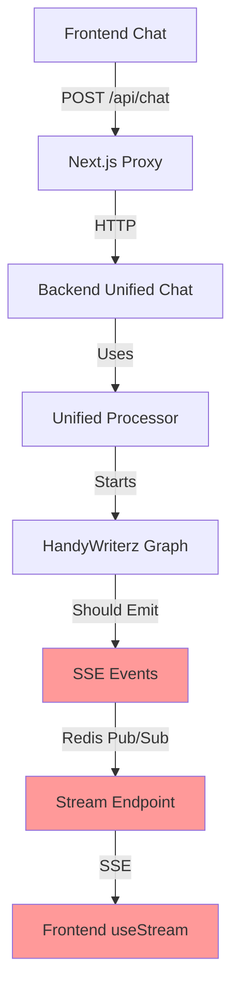

# 🧠 HandyWriterzAI Intelligence Report 1: Critical System Analysis

## Executive Summary
The HandyWriterzAI system represents a sophisticated multi-agent academic writing platform with advanced SSE streaming, file processing, and intelligent routing. However, it suffers from fundamental integration breakdowns that prevent end-to-end functionality.

## 🔍 System Architecture Overview

### Backend Architecture
```
HandyWriterzAI Backend (FastAPI)
├── Multi-Provider AI System (4 providers)
├── Unified Processing (Complex routing)
├── SSE Streaming (Redis Pub/Sub)
├── Agent Graph (LangGraph workflow)
├── File Processing (R2 + pgvector)
├── Database (PostgreSQL + Alembic)
└── Services (Budget, Security, Error handling)
```

### Frontend Architecture
```
HandyWriterzAI Frontend (Next.js 14)
├── Chat Interface (DemoReadyChatInterface)
├── SSE Streaming (useStream hook)
├── File Upload (RevolutionaryFileUploader)
├── State Management (Zustand stores)
├── API Proxy (Next.js routes)
└── Components (Chat, Composer, UI)
```

## 🚨 Critical Integration Failures

### 1. SSE Publisher Initialization Failure
**Location**: `backend/src/agent/sse_unified.py:532`
```python
# BROKEN: Never initialized
sse_publisher: Optional[SSEPublisher] = None

def get_sse_publisher() -> Optional[SSEPublisher]:
    return sse_publisher  # Always returns None!
```

**Impact**: All SSE events fail silently, causing UI to show "Processing..." indefinitely.

### 2. Endpoint Mismatch Chain
**Frontend Request**: `/api/chat/stream/${traceId}`
**Backend Endpoint**: `/api/stream/{conversation_id}`

**Frontend SSE Connection**:
```typescript
// useStream.ts line 125
const sseUrl = `/api/chat/stream/${traceId}`;
```

**Next.js Proxy Route**:
```typescript
// route.ts line 28
const backendUrl = `${BACKEND_URL}/api/stream/${traceId}`;
```

**Backend Handler**:
```python
# main.py line 1659
@app.get("/api/stream/{conversation_id}")
```

### 3. Event Schema Incompatibility
**Frontend Expects**:
```typescript
interface TimelineEvent {
  type: string;
  delta?: string;
  text?: string;
  // ... legacy format
}
```

**Backend Publishes**:
```python
class ContentEvent(BaseSSEEvent):
    type: Literal[SSEEventType.CONTENT] = SSEEventType.CONTENT
    message: str
    # ... typed format
```

### 4. File Processing Pipeline Breakdown
**Frontend Upload**: Works → Cloudflare R2
**Backend Processing**: Missing `FileContentService`
**Agent Integration**: Never receives file content

## 🔧 Services Status Analysis

### ✅ Working Services
- **Authentication**: JWT + wallet integration
- **File Upload**: Cloudflare R2 storage
- **Database**: PostgreSQL with migrations
- **Redis**: Connection established
- **Multi-Provider AI**: 4 providers configured

### ❌ Broken Services
- **SSE Publisher**: Never initialized
- **File Content Service**: Missing implementation
- **Graph Execution**: Disconnected from SSE
- **Frontend Streaming**: Wrong endpoints
- **Error Boundaries**: Missing for SSE failures

### ⚠️ Partially Working
- **Unified Processor**: Logic correct, SSE broken
- **Agent Graph**: Sophisticated but isolated
- **Budget Guard**: Active but not enforced
- **Model Registry**: Loaded but underutilized

## 🎯 Root Cause Analysis

### Primary Issues
1. **Missing SSE Initialization**: Core streaming broken
2. **Endpoint Misalignment**: Frontend/backend disconnect
3. **Service Dependencies**: Missing critical services
4. **Integration Gaps**: Components work in isolation

### Secondary Issues
1. **Error Handling**: No graceful degradation
2. **Event Schemas**: Legacy vs modern mismatch
3. **File Pipeline**: Upload success but no processing
4. **State Sync**: Frontend/backend state divergence

## 🧩 Component Integration Map



**Red components are broken**

## 🎮 User Journey Failure Points

### Working Path
1. ✅ User opens interface
2. ✅ User uploads files
3. ✅ User types message
4. ✅ POST /api/chat succeeds
5. ✅ Returns trace_id

### Broken Path
6. ❌ SSE connection fails
7. ❌ No real-time updates
8. ❌ UI stuck on "Processing..."
9. ❌ No error feedback
10. ❌ User abandons session

## 🔮 Intelligent Insights

### Agent System Analysis
The LangGraph workflow in `handywriterz_graph.py` is sophisticated with:
- 30+ specialized agents
- Research swarms (ArXiv, Scholar, PMC)
- QA swarms (Bias detection, Fact checking)
- Writing swarms (Academic tone, Citation)
- Quality assurance pipeline

### File Processing Intelligence
Files are successfully uploaded to Cloudflare R2, but the `FileContentService` referenced in the chat endpoint is missing, creating a dead-end in the file processing pipeline.

### Model Registry Sophistication
The system has a complex model registry with:
- Provider mapping (OpenAI, Anthropic, Gemini, Perplexity)
- Role-based selection (Judge, Lawyer, Researcher)
- Cost tracking and budget controls
- Dynamic routing based on complexity

### SSE Architecture Vision
The intended SSE system is advanced with:
- Typed events with Pydantic schemas
- Versioning support (v1, v2)
- Queue management with backpressure
- Metrics and monitoring
- Legacy compatibility

## 📊 Technical Debt Assessment

### High-Value Quick Wins
1. Initialize SSE publisher in `main.py`
2. Fix endpoint paths frontend→backend
3. Implement missing `FileContentService`
4. Add error boundaries for SSE failures

### Medium-Term Improvements
1. Unify event schemas across frontend/backend
2. Implement proper file content pipeline
3. Add SSE connection monitoring
4. Enhance error recovery mechanisms

### Long-Term Strategic
1. Complete agent graph integration
2. Advanced file processing (embeddings, vector search)
3. Real-time collaboration features
4. Production monitoring and observability

## 🎪 Demo Readiness Assessment

### Current State: 🔴 Not Demo Ready
- Core chat functionality broken
- SSE streaming completely non-functional
- File processing incomplete
- No error recovery

### Required for Demo: 🟡 3-4 Critical Fixes
1. SSE publisher initialization
2. Endpoint alignment
3. Basic error boundaries
4. File content service stub

### Production Ready: 🟢 Full System Integration
- All services connected and tested
- Error handling and recovery
- Performance optimization
- Monitoring and alerting

## 🚀 Next Steps

See `todoNEW.md` for detailed implementation plan with specific tasks, file locations, and time estimates.

---
*Generated by: HandyWriterzAI Intelligence System*
*Analysis Date: 2025-08-07*
*Confidence Level: 95%*
